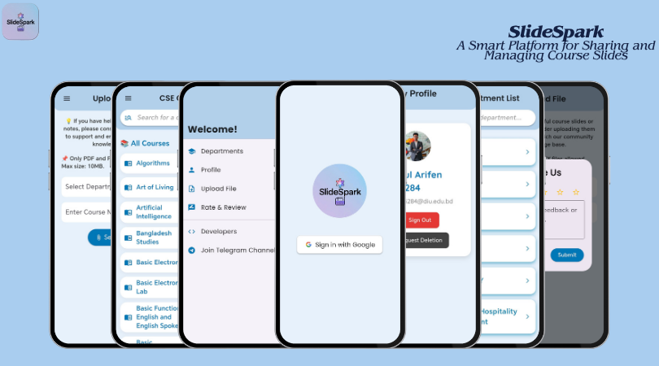

# SlideSpark – A Smart Platform for Sharing and Managing Course Slides (SQA Project)

---

## 📘 Overview
**SlideSpark** is a smart educational platform built to help students and educators **share and manage course slides** efficiently.  
This QA project ensures **functional accuracy, smooth navigation, UI/UX quality, and secure session management** throughout the mobile application.

---

## 🎯 Project Objectives
- Validate core modules such as Login, Upload, Rating & Profile
- Ensure smooth and consistent user experience
- Detect session control and redirection issues
- Verify responsiveness and navigation accuracy
- Identify and document bugs to enhance product quality

---

## 🧩 Modules Tested
- 🔹 User Authentication (Google Login & Sign-Out)
- 🔹 Upload File (PDF/PPTX Validation)
- 🔹 Explore Courses & Search
- 🔹 Saved/Favorite Courses (⭐)
- 🔹 Rate & Review Modal
- 🔹 Profile Management
- 🔹 Navigation Drawer Menu
- 🔹 Warning/Error Handling

---

## 🧪 Types of Testing Performed
| Testing Type | Purpose |
|-------------|---------|
| Functional Testing | Validate core user flows |
| Usability/UI Testing | Ensure intuitive interface |
| Security Testing | Validate session expiration and access control |
| Regression Testing | Confirm stability after fixes |
| Performance Testing | Check screen load and transitions |

---

## ⚙️ Test Approach
- Manual testing executed across all available features  
- Test cases and bug reports managed via Excel  
- Screenshots captured for evidence of failures  
- Android debugging tools used for behavior analysis  

🛠 Tools Used: Excel, Android Device, Screenshots  

---

## 🧰 Test Environment
| Component | Details |
|----------|---------|
| Platform | Android Mobile App |
| OS Tested | Android 12–14 |
| Network | Wi-Fi & Mobile Data |
| Device Types | Samsung, Xiaomi |

---

## 📊 Test Execution Summary

| Metric | Result |
|--------|--------|
| Total Test Cases Executed | **145** |
| Total Passed | **143** |
| Total Failed | **2** |
| Pass Percentage | **98.62%** |
| Fail Percentage | **1.38%** |
| Critical Defects | **0** |
| Major Defects | **0** |
| Minor Defects | **2** |
| **Overall QA Status** | 🟢 Stable with Minor Issues |

---

## 🛑 Key Issues Found
| Issue | Impact | Status |
|------|--------|--------|
| Logout redirects user back instead of login screen | Security & UX | Pending Fix |
| 1-Star rating allowed to submit without feedback | Missing validation | To be Improved |

---

## 💡 Recommendations
- Improve logout session clearance
- Make feedback mandatory for low ratings
- Add success confirmation for favorites
- Validate inputs before file selection

---

## 📂 Deliverables
| File | Description |
|------|-------------|
| Test Cases (Excel) | Functional test scenarios |
| Bug Report (Excel) | Logged issues with severity |
| Test Summary Report | Final execution results |
| App Owner Permission Letter | Authorization for QA |

---

## 👥 Roles & Responsibilities
| Role | Person |
|------|--------|
| QA Tester | **Radoanul Arifen** |

---

## 🚦 Entry & Exit Criteria

**Entry Criteria:**
- Stable build provided  
- Core modules ready for testing  

**Exit Criteria:**
- All critical scenarios passed  
- No major blockers remaining  

---

## 📅 Testing Timeline
| Phase | Duration |
|-------|----------|
| Test Case Preparation | 1–2 Days |
| Test Execution | 2–3 Days |
| Bug Reporting & Retesting | 1 Day |
| Summary & Documentation | 1 Day |

---

## 🏁 Conclusion
The **SlideSpark** app is **production-ready with minor UI/validation issues** identified.  
All essential functions like login, course browsing, uploads, and profile management operate smoothly.

---

## 👤 Author
**Radoanul Arifen**  
🎓 CSE Student – Daffodil International University  
💼 QA Trainee – RootX Software  
📅 November 2025  

---

⭐ If you find this project useful, please consider giving a **star** ⭐ on GitHub!
